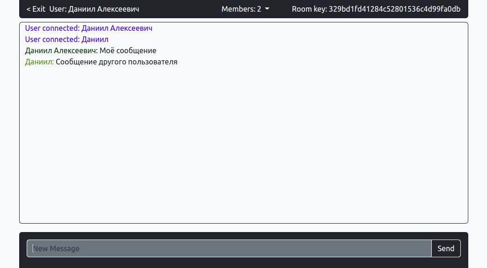

# Cryptomessage

### Description 
A lightweight project for secure messaging.

### Usage
#### Native usage 
```
$ pip3 install -r requirements.txt
$ python3 main.py
```
#### Docker usage
```
$ docker build . -t cryptomessage
$ docker run -d -p 8000:8000 --name cryptomessage cryptomessage
```
### Preview

